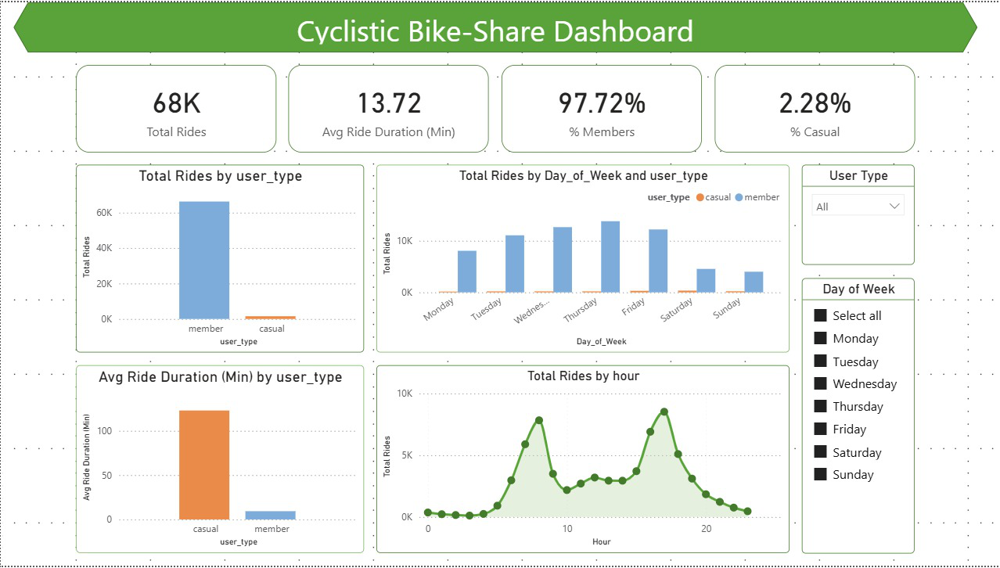

 # 🚴‍♂️ Cyclistic Bike-Share Rider Behavior Analysis  
### Data Analytics Case Study 


---

## 📁 Project Overview
This data analytics case study explores **Cyclistic bike-share usage** to understand behavioral differences between **casual riders** and **annual members**.  
The objective is to develop **data-driven strategies** to convert casual riders into annual members and boost long-term revenue.

This project follows the **Google Data Analytics Capstone Framework**:  
> **Ask → Prepare → Process → Analyze → Share → Act**

---

## 🎯 Business Objective
Identify how annual members and casual riders use Cyclistic bikes differently and provide insights and recommendations that support increasing membership conversions.

---

## 📊 Key Insights

| Insight | Interpretation |
|---|---|
Members take significantly more rides | Consistent **daily commuting** usage |
Casual riders take longer trips | **Leisure / tourism** pattern |
Member rides peak weekdays | **Work commute behavior** |
Casual rides peak weekends | **Recreational behavior** |
Commute peaks at 8 AM and 5 PM | Standard **rush-hour pattern** |

---

## 🧠 Summary Conclusions
- Annual members = **regular commuters**
- Casual riders = **leisure/weekend users**
- Best opportunity = **convert high-frequency casual leisure riders**
- Market membership as **flexible + cost-saving for weekend use too**

---

## 🚀 Recommendations

| Strategy | Reason |
|---|---|
Weekend/seasonal membership options | Attract weekend leisure riders |
Loyalty or rewards program | Encourage frequent casual riders to convert |
Target ads near tourist & park zones | Reach recreational riders at ride start-points |
Emphasize membership cost savings | Long casual rides = strong value case |

---

## 🛠 Tools & Skills Used

| Category | Tools |
|---|---|
Programming & EDA | Python, Pandas, NumPy, Seaborn, Matplotlib |
Notebook Environment | Google Colab |
Business Intelligence | Power BI |
Reporting | ReportLab (Python PDF automation) |
Skills | Data cleaning, EDA, Visualization, Feature Engineering, BI, Insights storytelling |

---

## 📂 Repository Structure
📦 cyclistic-bike-share-analysis
┣ 📂 data
┃ ┣ processed_cyclistics_trip_data.csv
┃ ┗ raw_data_sample.zip
┣ 📂 notebooks
┃ ┗ cyclistic_analysis.ipynb
┣ 📂 report
┃ ┣ Cyclistic_Final_Report.pdf
┃ ┣ Cyclistic_Bike_Share_Analysis_Case_Study.pdf
┃ ┗ cyclistics_Bike_Share_Dashboard.pdf
┣ 📂 visuals
┃ ┣ Cyclistic_Bike_Share_Dashboard.png
┃ ┣ ride_count_user_type.png
┃ ┣ avg_ride_length.png
┃ ┣ rides_by_day.png
┃ ┗ rides_by_hour.png
┗ README.md

---

## ✅ Deliverables

| Deliverable | Status |
|---|---|
Cleaned dataset | ✅  
Python notebook | ✅  
Exploratory visuals | ✅  
Power BI dashboard | ✅  
Final PDF case study | ✅  
Full project on GitHub | ✅  

---

## 📸 Dashboard Snapshot

Here’s a preview of the final dashboard:



---

## 📄 Reports

| File | Description |
|---|---|
| [Case Study PDF](report/Cyclistic_Bike_Share_Analysis_Case_Study.pdf) | Final polished case study |
| [Final Report PDF](report/Cyclistic_Final_Report.pdf) | Insights + visuals report |
| [Power BI Dashboard PDF](report/cyclistics_Bike_Share_Dashboard.pdf) | Exported BI dashboard |

---

## 🧪 Quickstart Guide

### Clone repo
```bash
git clone https://github.com/pawanya028/cyclistic-bike-share-analysis.git

Install dependencies
pip install pandas numpy matplotlib seaborn

Run Notebook
Open and run:
notebooks/cyclistic_analysis.ipynb

Open Power BI Dashboard
Power_BI_Dashboard/cyclistics_Bike_Share_Dashboard.pbix
```
---
### 🧑‍💻 Author 
**Pawan Yadav** 
Data Analyst | Python | SQL | Power BI | EDA 

--- 
### 📌 Contact & Portfolio
- LinkedIn:
- Portfolio:
- Email: Pawanya28@gmail.com
---
This project demonstrates real-world data analytics skills, from data cleaning and EDA to BI dashboarding and business recommendations.
Inspired by the Google Data Analytics Capstone Case Study.
